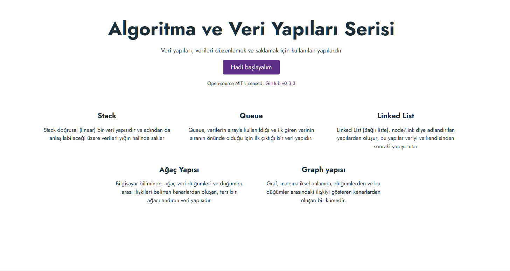

<h1 align="center">
  Algoritma Ve Veri Yapıları Rehberi
</h1>

  Bilgisayar biliminde oldukça önemli bir role sahip olan ve her yazılım geliştiricisinin öğrenmesi gereken veri yapıları ve algoritma konuları için rehber niteliğindedir.

  <a href="http://algorithm-and-data-structures.vercel.app/">Rehberi İncele<a>

  

